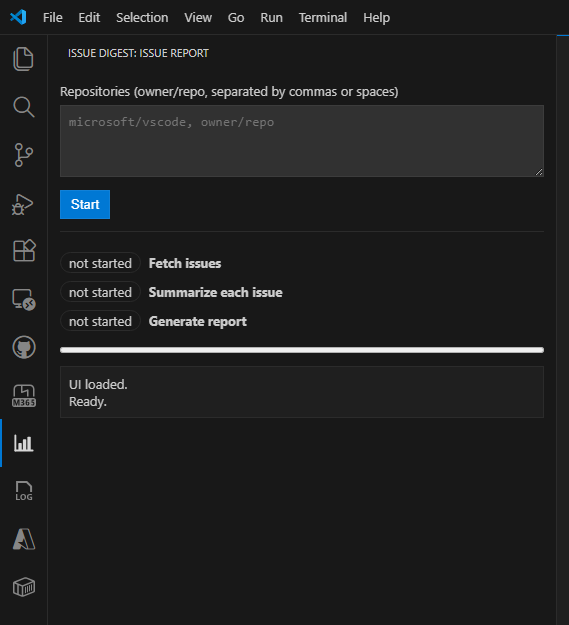

# Issue Digest for VS Code

**Turn GitHub Issue chaos into clear, actionable insights.**

Issue Digest leverages the power of **GitHub Copilot** to automatically fetch, analyze, and summarize the discussions happening in your GitHub repository. Stop drowning in notifications and start understanding your community and project health at a glance.

## Why Issue Digest?

*   **🚀 Save Hours of Reading**: Instantly get the gist of long, complex issue threads without reading every comment.
*   **💡 Spot Trends Fast**: Identify recurring bugs, feature requests, and sentiment shifts across your user base.
*   **📊 Effortless Reporting**: Generate professional status reports and digests with a single click—perfect for stand-ups and stakeholder updates.

## Key Features

*   **AI-Powered Summaries**: Intelligent condensation of issue threads using GitHub Copilot.
*   **One-Click Reports**: Generate a comprehensive digest of open issues, recent activity, and hot topics.
*   **Seamless Integration**: Works directly within VS Code, connecting securely to your GitHub repositories.

## How to Use

1.  Open the **Issue Digest** view in the Activity Bar.
2.  Fill up the repositories.
3.  Click **"Generate Report"**.
4.  View the summarized insights right in your editor!

*(See the screenshot above for a quick guide)*

## Requirements

*   VS Code ^1.107.0
*   GitHub Copilot access
